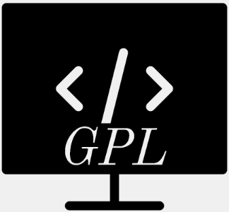

#  Graphical Programming Language Application
<p float="left">
  
<span>
This application is based on producing a simple programming language and environment to explore them using graphics.
 This application helps new student programmer to explore using graphics.
</span>
</p>


# GPL Desktop View

1. Multiple Line Program textarea:
   This section allows developer to write multiline code at once's to perform display operation.
2. Output Display:
   This section display all the output as per the given command or instruction on section 1 or 3.
3. Single Line Command text field:
   This section allows developer to write single line code to perform display operation.
4. Run button:
   This button run the command or program given on section 1 and 3 and display output on output box. This also validate syntax of the programming.
   And this application always give priority to section 3 (single line code first) and if there is no single line code then it will go for section 1 (multiline code program).
5. Syntax button:
   This button checks all syntax error and compile program.
6. Open button:
   This button open command from file and display on multiple line program textarea.
7. save button:
   This button save command to file from single line program text filed or multiple line program textarea.


# Basic Overview On Available Command

| S.N | Command                      | Description                                                                                                                                                                                       |
|-----|------------------------------|---------------------------------------------------------------------------------------------------------------------------------------------------------------------------------------------------|
| 1   | saveToFile \<filepath>       | This command save program to a filepath as given in parameter. filepath should be absolute path (i.e. c:/abc/abc.txt). You can also save file using file menu and then clicked on save menu.      |
| 2   | readFromFile \<filepath>     | This command read program from a given filepath and execute. You can also open file using file menu and then clicked on open menu.                                                                |
| 3   | moveTo \<x>,\<y>             | This command move the pen or cursor to the given x and y axis.                                                                                                                                    |
| 4   | circle \<radius>             | This command draw a circle with a given radius.                                                                                                                                                   |
| 5   | rectangle \<width>,\<height> | This command draw a rectangle with given width and height.                                                                                                                                        |
| 6   | triangle \<base>,\<adjacent> | This command draw a triangle with given base and adjacent.                                                                                                                                        |
| 7   | drawTo \<x>,\<y>             | This command draw a line to particular x and y axis from the pen position.                                                                                                                        |
| 8   | //                           | This command is comment purpose to ignore some code from execution like other programming language. Note: please make sure // has one space before your words in between example // your_comments |
| 9   | clear                        | This command clear the output box but does not move pen position or reset pen color.                                                                                                              |
| 10  | reset                        | This command trigger the clear command along with reset all set parameter i.e pen position or pen color and others.                                                                               |
| 11  | pen \<color>                 | This command set the pen color to draw any shape and by default black is set. Values accepted are all valid color names.                                                                          |
| 12  | fill \<boolean>              | This command fill the shape if set on. Values accepted are on,off.                                                                                                                                |

# Sample Command For Testing Basic Operation
```
	clear
	pen red
	moveTo 5,5
	rectangle 150,100
	pen gray
	moveTo 150,100
	circle 50
	pen yellow
	moveTo 50, 50
	fill on
	triangle 100,100
	
	// few more command for testing
	fill off
	pen blue
	moveto 0, 200
	rectangle 80,80
	circle 80
	moveto 25,205
	triangle 50,50
```
